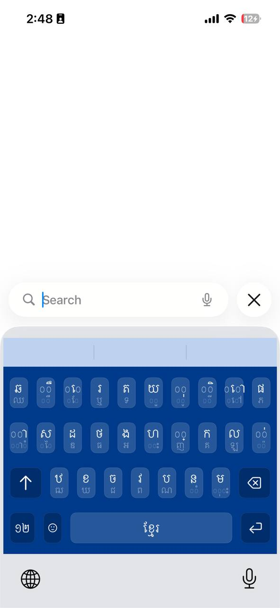

# Longvek Keyboard (KBoard AI)

Longvek Keyboard is a modern, high-performance Khmer and English keyboard for iOS. It features a smart prediction engine, gesture controls, and an efficient, low-memory architecture designed for stability and speed.

## 🚀 Features

### 🧠 Smart Prediction Engine
*   **Next-Word Prediction**: Context-aware suggestions based on the previous word.
*   **Frequency-Based Sorting**: Suggestions are ordered by usage frequency.
*   **Bilingual Support**: Seamlessly predicts Khmer and English words.
*   **Bigram Support**: Uses language models to improve sentence flow.

### ⚡ High Performance & Safety
*   **SQLite-Backed Dictionary**: 
    *   Uses a lightweight SQLite database instead of loading huge JSON files into RAM.
    *   Capable of handling 300,000+ words with minimal memory footprint (< 30MB).
*   **Lazy Loading**: 
    *   The dictionary is downloaded/installed on demand, ensuring the keyboard starts up instantly.
    *   Includes a "Download Dictionary" prompt for first-time users.
*   **Background Processing**: Prediction logic runs on background threads to keep the UI responsive.

### 🎨 Modern UI & UX
*   **Scrollable Prediction Bar**: 
    *   Handles long Khmer words gracefully with a horizontal scroll view.
    *   Modern blur background (`UIVisualEffectView`) matching native iOS aesthetics.
*   **Gesture Controls**:
    *   **Swipe Left**: Fast delete (Backspace).
    *   **Swipe Up/Down**: Toggle between 4-row and 5-row Khmer layouts.
*   **Theming**: Supports Light and Dark modes with customizable styles.

## 🛠 Architecture

The project is divided into two targets:

1.  **LongvekKeyboard (Main App)**: 
    *   Handles settings, tutorials, and theme management.
    *   Responsible for downloading/updating the dictionary and processing it into an optimized SQLite database.
    *   Saves data to a shared App Group container.

2.  **IBoardAI (Keyboard Extension)**:
    *   The actual keyboard extension.
    *   Reads from the shared SQLite database using lightweight queries (`SELECT ... LIMIT 3`).
    *   Designed to stay strictly within the 30MB memory limit imposed by iOS on keyboard extensions.

## 📥 Installation

1.  Clone the repository.
2.  Open `LongvekKeyboard.xcodeproj`.
3.  Select your Development Team in the "Signing & Capabilities" tab for both targets.
4.  Build and run on your device or simulator.
5.  Go to **Settings > General > Keyboard > Keyboards > Add New Keyboard** and select **LongvekKeyboard**.
6.  Tap the keyboard entry and enable **"Allow Full Access"** (Required for the prediction engine to read the shared database).

## 📂 Project Structure

*   `IBoardAI/Models/KBPredictionEngine`: Core logic for SQLite predictions.
*   `IBoardAI/Views/PredictionBar`: Custom toolbar with scrolling and animations.
*   `IBoardAI/Data`: Raw JSON datasets (converted to SQLite at runtime).
*   `LongvekKeyboard`: Main app UI for settings and guides.

## 🔒 Privacy

Longvek Keyboard respects user privacy. 
*   **Full Access** is requested solely to access the shared prediction database and handle themes.
*   No keystrokes are sent to external servers.
*   All prediction processing happens locally on the device.

## 📝 License

[MIT License](LICENSE)
